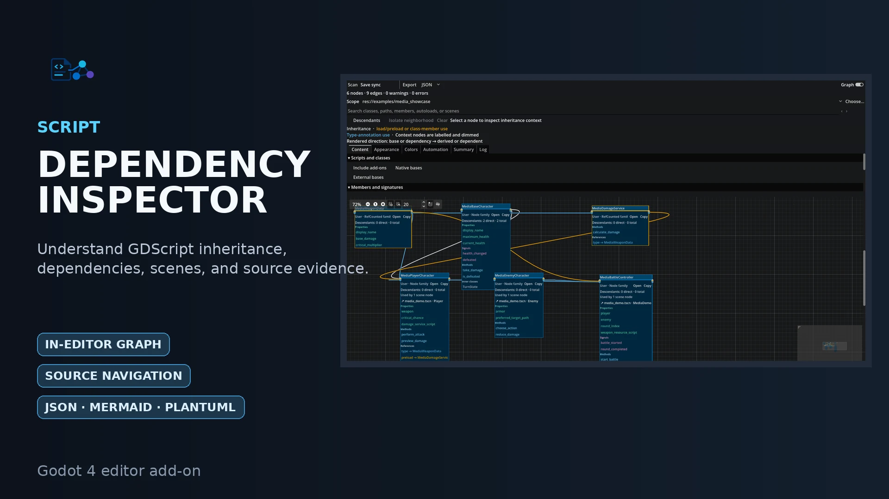

# Script Dependency Inspector

Godot 4 editor add-on for deterministic GDScript inheritance/dependency analysis, scoped architectural inspection, editor navigation, exact text-scene usage, and JSON/Mermaid/PlantUML export.

Release `0.3.0` targets the supplied Linux x86_64 editor builds of Godot 4.3, 4.4.1, 4.5.2, 4.6.3, and 4.7. Release-specific verification results are delivered outside the source repository.

## Install

Copy `addons/script_dependency_inspector` into a project and enable **Project > Project Settings > Plugins > Script Dependency Inspector**.

## Primary workflow

The dock scans automatically after saved editor filesystem changes by default, using a one-second quiet-period debounce. Timed rescanning remains available and disabled by default. Press **Scan** for an immediate refresh.

Choose the entire project or a project folder from the scope selector. Native filesystem dialogs may return an absolute path; project-local selections are normalized back to `res://` before validation. A folder scope keeps scripts inside that folder and retains only the outside ancestors and direct dependency targets needed to explain them. Retained nodes are marked **Context** in the graph and in diagram exports. Scope selection changes the displayed/exported projection; the bounded full-project index is still acquired so outside context can be resolved.

Select a node to emphasize its inheritance path. Optionally include descendants or isolate the selected relationship neighborhood without rescanning. Nodes show direct and total descendant counts. Search matches class names, paths, members, autoloads, scenes, and scene-node paths. Script headers, member rows, dependency references, and scene rows navigate to the recorded source or scene when available.

JSON is the lossless snapshot-v2 output. Mermaid and PlantUML are diagram representations. Independent automatic exports can run after each synchronized, manual, or timed scan.


## Interactive or export-only workflow

The **Graph** toggle is on by default. Disable it to keep scanning, save synchronization, summaries, diagnostics, and JSON/Mermaid/PlantUML export without allocating the dock to GraphEdit. Re-enabling the graph renders the retained validated snapshot without another scan.

The built-in graph is suited to in-editor inspection. Exported Mermaid and PlantUML can be opened in dedicated diagram tools for larger canvases, alternate layout engines, themes, and presentation workflows; JSON supports lossless automation or custom renderers. The toolbar identifies whether scanning is save-synchronized, timed, both, or manual.

## Analysis boundary

The analyzer does not load or instantiate analyzed project GDScript for dependency discovery and does not claim a general call graph. Dynamic paths, aliases, runtime receiver inference, dependency injection, reflection behavior, binary scenes, and transitive scene/resource effects are omitted rather than guessed. TODO/FIXME/HACK extraction and immediate main-screen placement are explicit non-goals.

## Documentation

- [User use cases and diagrams](docs/USE_CASES.md)
- [Design](docs/DESIGN.md)
- [Product requirements](docs/REQUIREMENTS.md)
- [Release requirements](docs/RELEASE-REQUIREMENTS.md)
- [Quality contract](docs/QUALITY-CONTRACT.md)
- [Release gates](docs/RELEASE-GATES.md)
- [Traceability](docs/TRACEABILITY.md)
- [Architecture](docs/ARCHITECTURE.md)
- [Snapshot schema](docs/SCHEMA.md)
- [Security boundary](docs/SECURITY.md)
- [Performance](docs/PERFORMANCE.md)
- [Validation](docs/VALIDATION.md)
- [Compatibility policy](docs/COMPATIBILITY.md)
- [Validation procedure](docs/VALIDATION.md)
- [Roadmap](docs/ROADMAP.md)
- [Comprehension protocol](docs/COMPREHENSION_TEST.md)
- [Release packaging and patches](docs/RELEASING.md)
- [Contributing](CONTRIBUTING.md)
- [Changelog](CHANGELOG.md)
- [AI usage disclosure](AI_USAGE_NOTICE.md)

## Development validation

```sh
python3 tools/run_validation.py --godot /path/to/godot --output validation-artifacts
```

The repository-owned current Godot Asset Library media lives under `docs/asset_store/current/`. Source captures and documentation screenshots are kept under `docs/asset_store/` and excluded from Godot resource import with `.gdignore`.

## Media and interface reference

- [Interface gallery](docs/INTERFACE_GALLERY.md)
- [Current Godot Asset Library media](docs/asset_store/README.md)


