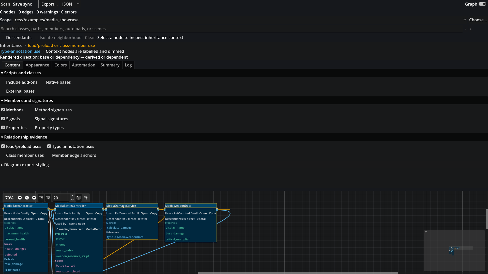
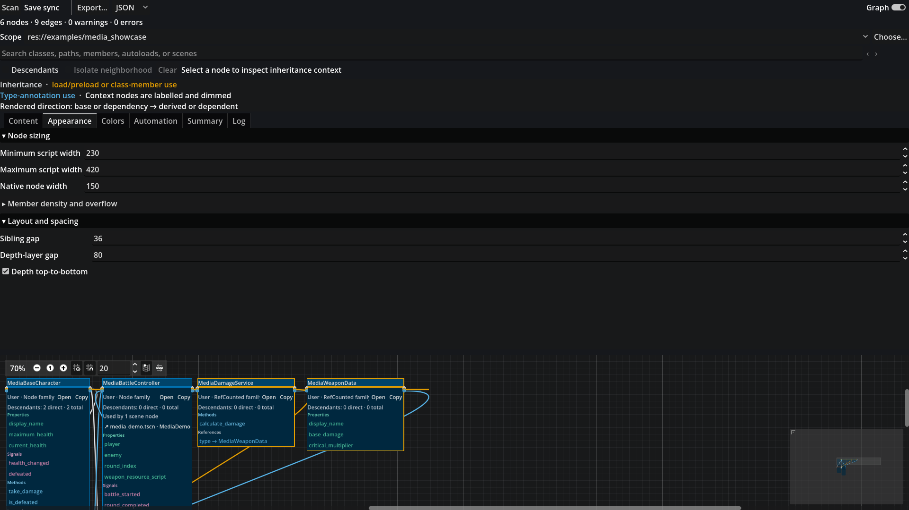
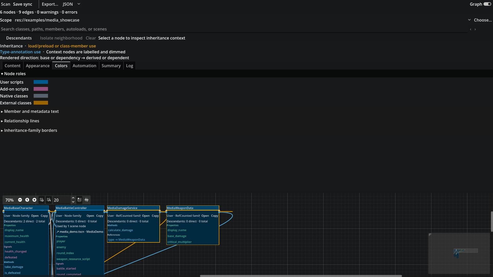
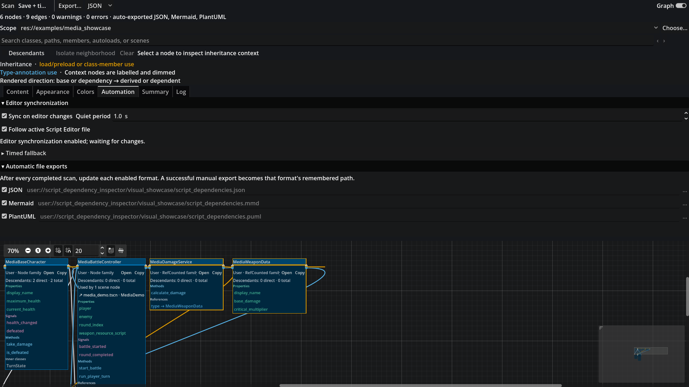
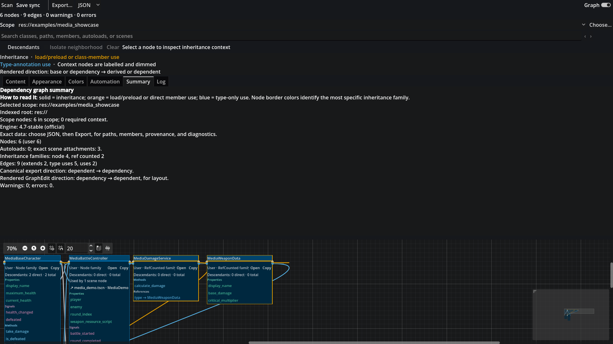
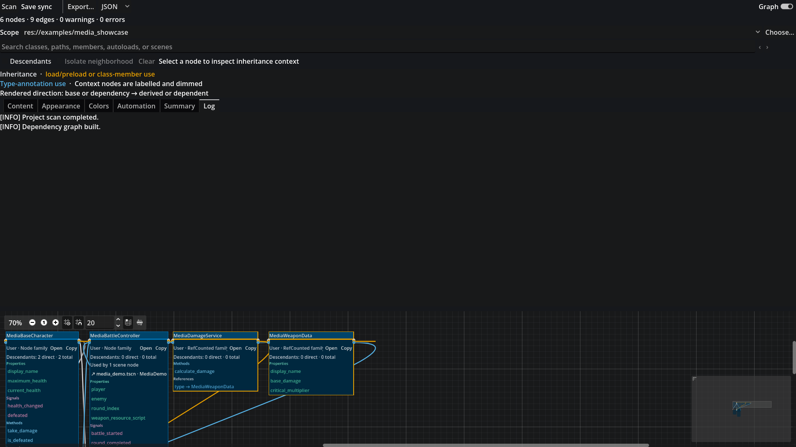

# Interface gallery

These screenshots document each principal dock tab using the same small real project fixture. They are intended as a user-facing reference, not as substitutes for runtime testing.

## Content

## Appearance

## Colors

## Automation

## Summary

## Log

