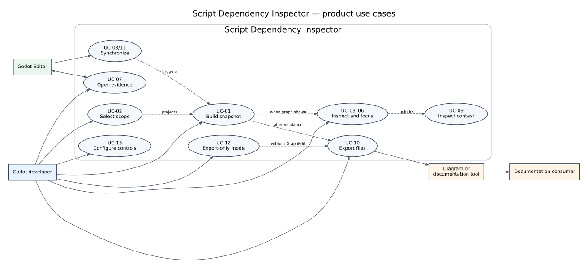
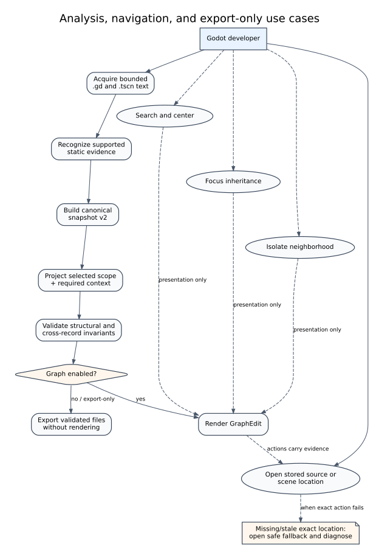
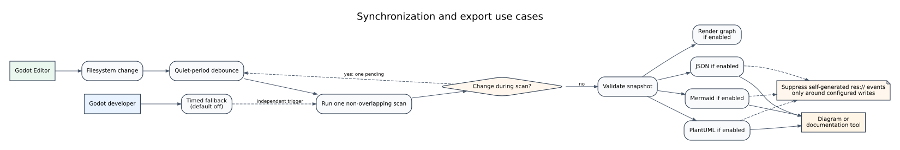

# User use cases

Version: 0.2.4
Status: implemented use cases are linked to the behavioral contract and release validation

## Purpose

This layer describes the outcomes a Godot developer seeks from Script Dependency Inspector. It sits above implementation design and below marketplace copy. The diagrams are navigation aids; the catalogue is the authoritative text alternative.

## Actors

- **Godot developer** — enables and operates the editor add-on.
- **Godot Editor** — supplies files, filesystem-change events, active-script changes, and navigation services.
- **Diagram or documentation tool** — imports Mermaid, PlantUML, or JSON for larger-canvas rendering, theming, documentation, or further processing.
- **Documentation consumer** — reads or presents exported architecture evidence.

## Use-case catalogue

| ID | Use case | Observable outcome | Important boundary or failure behavior |
|---|---|---|---|
| UC-01 | Build a dependency snapshot | A deterministic validated snapshot is produced from bounded project-local inputs. The graph is rendered when enabled. | Invalid roots stop the scan; unreadable optional files produce diagnostics; user scripts are not instantiated. |
| UC-02 | Restrict the displayed project scope | The selected folder remains with required outside ancestors and direct dependency targets retained as labelled context. | The full bounded project index is still acquired to resolve context. Missing remembered folders fall back to `res://` with a warning. |
| UC-03 | Inspect inheritance and dependencies | Inheritance, literal/resource use, type-only use, and explicit class-qualified member use can be distinguished. | Dynamic, ambiguous, and runtime-only relationships are omitted rather than guessed. |
| UC-04 | Focus an inheritance path | Selecting a node emphasizes ancestors and optional descendants; direct and total descendant counts are shown. | Focus is presentation-only and does not mutate the snapshot or exports. |
| UC-05 | Isolate a relationship neighborhood | Unrelated graph nodes are hidden while selected inheritance and direct dependency context remains. | Clearing focus restores the current scoped graph without rescanning. |
| UC-06 | Find a class or member | Search matches class names, paths, members, autoloads, scenes, and scene-node paths. | Search changes presentation only; an empty query restores normal presentation. |
| UC-07 | Navigate to source or scene | Actions open exact recorded source locations or scenes when available. | Stale locations use a safe fallback without claiming exact navigation. |
| UC-08 | Follow editor activity | Saved filesystem changes trigger one debounced scan by default; the active Script Editor file can select its graph node. | Scans never overlap; changes during a scan produce at most one pending follow-up. Timed rescanning remains independent and default-off. |
| UC-09 | Inspect editor context | Autoload identity and exact text-scene node attachments are visible and searchable. | Binary scenes, dynamic construction, and transitive scene/resource effects are outside the evidence boundary. |
| UC-10 | Export architecture evidence | JSON, Mermaid, or PlantUML is written from the same validated snapshot and can be opened in dedicated third-party tools. | JSON is lossless. Diagram formats are representations and may omit evidence that their syntax cannot express. |
| UC-11 | Keep exports synchronized | Enabled formats are updated independently after a completed scan. | One failed format does not block others; staged replacement protects prior output where possible. |
| UC-12 | Operate in export-only mode | The developer hides GraphEdit while retaining scans, synchronization, summaries, diagnostics, and manual/automatic file export. | Hiding the graph releases rendered graph nodes but retains the current validated snapshot. Re-enabling renders that snapshot without forcing a new scan. |
| UC-13 | Configure controls efficiently | Controls are grouped into foldable semantic sections and the scan trigger mode is visible beside **Scan**. | Fold state and graph visibility persist project-locally; every option retains an explanatory tooltip. |

## Diagrams

### Product use-case overview

**Text alternative:** A Godot developer builds and scopes a validated snapshot, optionally renders and inspects the interactive graph, navigates to evidence, or operates export-only. Editor events can synchronize scans. JSON, Mermaid, and PlantUML files are consumed by documentation or dedicated diagram tools.

### Analysis and navigation

**Text alternative:** Bounded source acquisition, supported static recognition, graph construction, scope projection, and validation always precede public output. Graph rendering is optional. Search, focus, isolation, and navigation operate only when the graph is visible, while export-only operation consumes the validated snapshot directly.

### Synchronization and export

**Text alternative:** Editor filesystem changes use a quiet-period debounce and start one non-overlapping scan. Timed fallback is a separate default-off trigger. After validation the graph is rendered only when enabled, then JSON, Mermaid, and PlantUML exports are attempted independently and may be opened in dedicated tools.

## Traceability

| Use cases | Primary contract/design sections | Principal automated evidence |
|---|---|---|
| UC-01, UC-03 | `CONTRACT.md`; canonical model in `DESIGN.md` | Scanner/analyzer/builder/validator tests; export matrix |
| UC-02 | Scope contract; ADR 0006 | Scope projection and validation tests |
| UC-04, UC-05 | Presentation queries | Graph-query tests and rendered focus/isolation states |
| UC-06, UC-07 | ADR 0004 | Search/navigation tests and screenshots |
| UC-08, UC-11 | ADR 0003/0004 | Automation runner and non-overlap tests |
| UC-09 | ADR 0005 | Scene/autoload scanner-builder-validator tests |
| UC-10 | `SCHEMA.md`; exporter contracts | Exporter suite, export matrix, file-integrity checks |
| UC-12, UC-13 | ADR 0007; current UI contract | Export-only rerender test, compact-toolbar and fold-state contracts, rendered screenshots |

Independent unfamiliar-user comprehension remains unverified. These diagrams represent intended use, not evidence that every user will discover or understand each workflow unaided.
